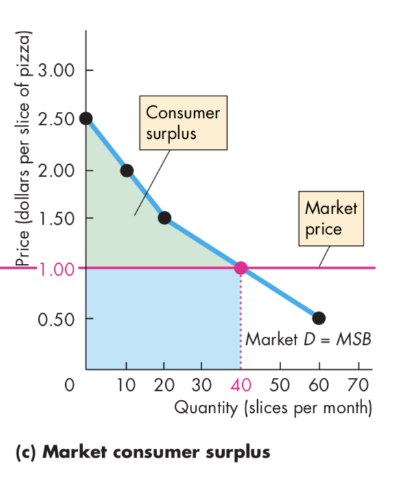
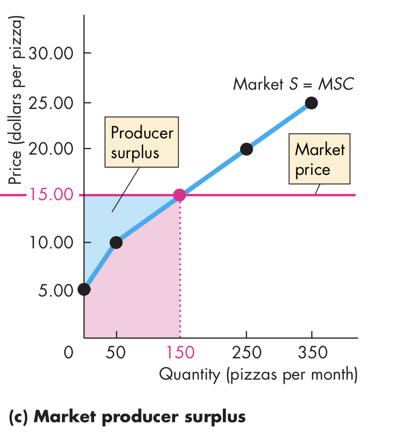
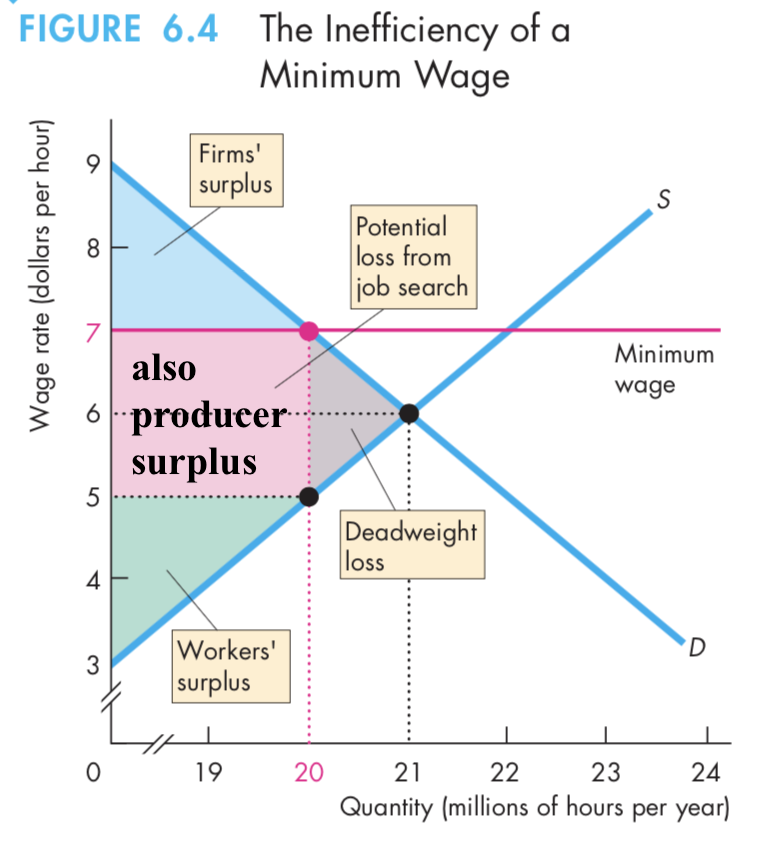
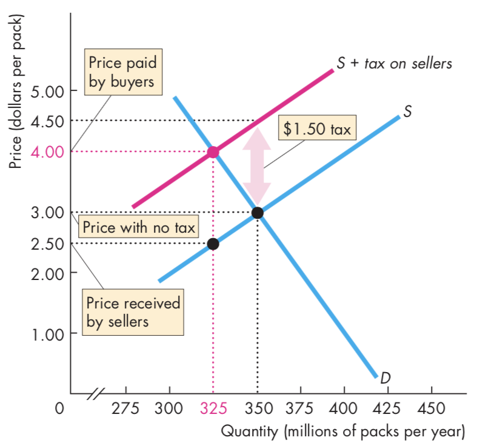
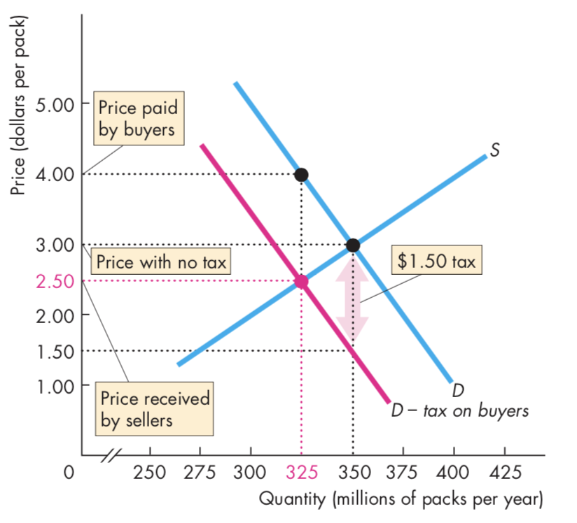
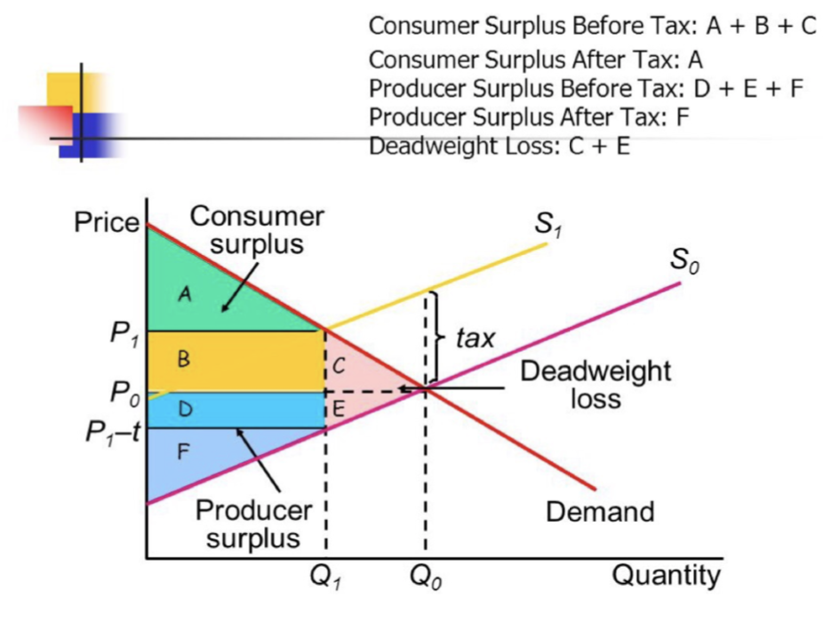
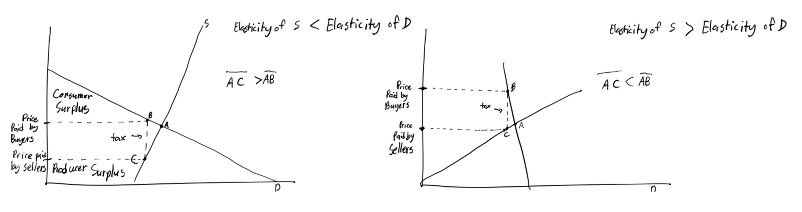
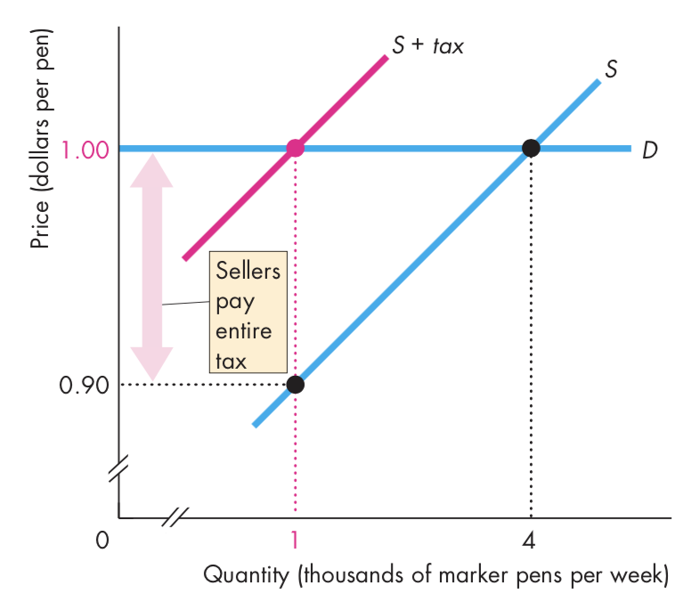

# 4. Elasticity

---------------------------------------------------------

## Price Elasticity of Demand ($\eta$)
Measure of the change in Quantity Demanded based on the change in price
$$\eta=\left|\frac{\%\Delta Q_d}{\%\Delta P}\right|$$

### Example
| Point | $P$ | $Q_D$ |
|:--|:--|:--|
| A | 1 | 17 |
| B | 2 | 11 |
| C | 3 | 7 |

$$\%\Delta Q_D = 100\frac{\Delta Q_D}{Q_{ave}}$$
$$\%\Delta P = 100\frac{\Delta P}{P_{ave}}$$
$$\therefore$$
$$\eta=\frac{(|Q_{D2}-Q_{D1}|)(P_{2}+P_{1})}{(Q_{D2}+Q_{D1})(|P_{2}-P_{1}|)}=\frac{|\Delta Q_D|\sum(P)}{|\Delta P|\sum(Q)}$$

### Critical Values of Elasticity
#### Perfectly Inelastic ($\eta = 0$)
* No sensitivity to price
* Quantity Demanded is Completely Irresponsive to Price
* Vertical line
* For necessities and monopolies

>>>> 

#### Unit Elastic ($\eta = 1$)
* $\%\Delta Q_d=\%\Delta P$
* Hyperbola
>>>> 

#### Perfectly Elastic ($\eta = \infty$)
* Extreme sensitivity to price
* Horizontal line
* For generic goods and perfect competition
>>>> 

### Degrees of Elasticity
* Inelastic 
	* $\eta < 1$
* Elastic
	* $\eta > 1$

### Relationship Between Slope and Elasticity
Elasticity decreases as there is movement along straight demand curve

### Implication of Elasticity: Total Revenue
$$TR = PQ_D$$

| Point | $P$ | $Q_D$ | PED | TR | 
|:--|:--|:--|:--|:--|
| A | 1 | 17 | 0.64 | 17 |
| B | 2 | 11 |1.1 | 22 | 
| C | 3 | 7 | | 21 |

#### For Inelastic Goods
$$P \propto TR$$

* Since $Q_D$ is insensitive, the change of $P$ determines $TR$

#### For Elastic Goods

$$P \propto \frac{1}{TR}$$
* Since $Q_D$ is sensitive, the change of $Q_D$ determines $TR$

>>>> 
>>>> 

### Factors Affecting Price Elasticity of Demand
#### Substitutes
Fewer substitutes means less elasticity

#### Necessity/Luxury
The more a good is needed, the more inelastic it is

* **Necessity**
	* More inelastic
* **Luxury**
	* More elastic

#### Percent of Income Spent on a Good
Greater percentage income means higher PED

* **Large proportion**
	* Elastic
* **Small Proportion**
	* Inelastic

## Cross-Price Elasticity of Demand ($\eta_c$)
Elasticity when comparing two goods

$$\eta_c=\frac{\%\Delta Q_D^A}{\%\Delta P^B}$$

### Complements
Negative

### Substitutes 
Positive

### Elasticity
* **Greater Absolute Value**
	* Elastic
* **Lower Absolute Value**
	* Inelastic

## Income Elasticity of Demand ($\eta_y$)
responsiveness of consumers' demand for a good to a change in their income

$$\eta_y=\frac{\%\Delta Q_D}{\%\Delta Y}$$

### Normal Good
Positive

### Inferior Good
Negative

## Elasticity of Supply ($\eta_s$)
Sensitivity of Quantity Supplied by a percent change in price

$$\eta_s=\left|\frac{\%\Delta Q_s}{\%\Delta P}\right|$$

### Perfectly Elastic ($\eta_s = \infty$)
>>>> 

### Perfectly Inelastic ($\eta_s = 0$)
>>>> 

## Surplus
### Consumer Surplus
Difference between what consumer is willing and able to pay with what they are paying.

>>>> 

### Producer Surplus
Difference between what producers get paid and minimum price they are willing go accept

>>>> 

## Price Floors
* Price cannot fall below a certain level
* Only matters if above equilibrium price

>>>> 

### Labor Market
* Factor Market
* Firms demanding labor, workers supply labor
* Price is wage
* Quantity is number of people working

#### **Minimum Wage**
* Kind of price floor
* (in graph) Amount of people willing and able to work is at 22, and amount of employed workers is at 20
	* Difference between two is **unemployment**
* Paper: Minimum Wage Increases Wages and Low-Wage Employment: Evidence From Seattle

#### Consumer and Producer Surplus
Consumer surplus decreases and change in producer surplus is ambiguous

#### Deadweight Loss
Surplus that would be gotten with equilibrium but lost due to price floor

## Taxes
### Statutory Incidence
* Who pays the tax according to the law
* Does not affect the economic incidence
	* Law doesn't affect who actually pays for tax
	* 
* **Taxes on Producer** 
	* 
	* Producers increase in price to pay for tax
	* 
* **Taxes on Consumer** 
	* 
	* Producers have to charge the amount of tax less in price for the same quantity

### Specific Tax 
> 

Causes difference between price consumers are paying ($S_1$) and price suppliers put in their pocket ($S_0$)

At $Q_1$ is the most consumers are willing to pay ($P_1$) and the minimum amount producers are willing to receive ($P_1-t)$, and the difference is tax. Only quantity this occurs.

* **Tax Revenue ($B,D$)**
	* Amount of money received by government 

### Tax Incidence
Division of tax burden, who pays the tax between buyers and sellers

The more inelastic is demand, the greater tax burden on consumers

#### Perfectly Elastic Demand
>>> 

#### Perfectly Inlastic Demand
>>> 

