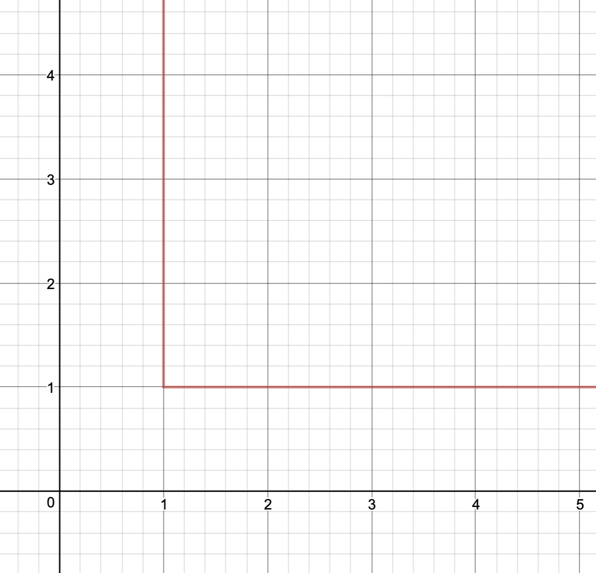

# Utility

Satisfaction attained by consuming a good or service

Measured in Utils

## Total Utility
Total benefit 

>>> 

## Marginal Utility
Change in Total Utility from consuming one more unit (Derivative of Total Utility)

Additional benefit from consuming one more of a good or service

>>> 

### Ranges of Marginal Utility
* **Increasing Marginal Utility**
	* Total Utility is increasing at faster rate
* **Decreasing Positive Marginal Utility**
	* Total Utility is increasing at lower rate
* **Decreasing Negative Marginal Utility**
	* Total Utility is decreasing at faster rate

### Law of Diminishing Marginal Utility
* Ceteris Paribus, at some point, continued consumption will lead to smaller gain in utility, or losses of utility. 
	* 
* Marginal Utility will diminish
	* Not necessarily negative

## Comparing Utilities of Two Goods/Services
### Indifference Curve
>>>>> 

* Indifferent between all points
	* same amount of utility
* 
* **Set of Preferred Bundles**
	* Bundles Outside curve
	* Convex set
* **Set of Not Preferred Bundles**
	* Bundles inside curve
* 
* **Marginal Rate of Substitution**
	* Slope of Indifference Curve
	* How much y-axis good willing to give up to get more of x-axis good

#### Variety
* Shape of Curve determines importance of variety
*
* **Perfect Complements**
	* Variety is Essential
	>>>> 
	* Right Angle
* **Perfect Substitutes**
>>>> 

#### Properties of Indifference Curve
* Can have more than one indifference curve
>>>
* Indifference Curves don't cross

## Utility Maximizing Choice
Maximizing utility in the face of scarcity

### Assumptions
1. Spend all income
2. Set marginal utility per dollar spent equal for all goods
	* $$\frac{MU_a}{P_a}=\frac{MU_b}{P_b}$$

### Consumer Equilibrium
If consumers are maximizing utility given the price they face

When not in consumer equilibrium, meaning $\frac{MU_a}{P_a}\neq\frac{MU_b}{P_b}$, then one good is favored than the other until its marginal utility decreases enough to create an equality.

### Elasticity
* **Inelastic**
	* Marginal utility changes very rapidly with change in price
	* Therefore an inequality with an inelastic good will quickly return to equilibrium
		* Since when there is an inequality, more money is placed on other good, and so price changes, which leads to marginal utility to drastically change
		* 
* **Elastic**
	* Marginal utility changes slowly change with price
	* Large amount of money must be moved to other good to restore equality
		* Since marginal utility does not change fast enough to restore equilibrium quickly

## Income ($m$)
>>>>> 

* **Function of Budget Line**
	* Let $x$ be amount of good $x$ and $P_x$ be price of $x$ and $y$ be amount of good $y$ and $P_y$ be price of $y$
	* $$P_xx+P_yy=m$$
	* $$y=-\frac{P_x}{P_y}x+\frac{m}{P_y}$$
		* x-intercept: $\frac{m}{p_x}$

		* y-intercept: $\frac{m}{p_y}$
		* slope: $-\frac{P_x}{P_y}$
			* Opportunity cost/marginal cost

### Indifference Curve
* Consumer equilibrium will never be at the indifference curve's intersection with budget line when there are two intersection
* Consumer Equilibrium is
	* between intersections, 
	* on the budget line,
	* where indifference curve is tangent to budget line
		* Marginal Rate of Substitution is equal to budget line
	* Not necessarily on center of budget line

### Rise in income
* Budget line increases up and to right, same rules follow
* **One Inferior Good**
	* If new consumer equilibrium has less consumption of a good than old consumer equilibrium, then good is inferior
* **Both Normal Goods**
	* If consumer equilibrium is up and to right of old consumer equilibrium, then both goods are normal

### Change in Price (Indifference Curve and Demand)
* Increase in price of good reduces budget line and consumer equilibrium
* >>
* Demand Curve for an individual is equivalent to change in consumer equilibrium in price
	* price derivative of consumer equilibrium
* Market $Q_d$ is sum of individual $Q_d$

## Finding Consumer Equilibrium
### Example
* **Movies**
	* $MU = \frac{1}{\text{movies}}$

* **SB Cubs**
	* $MU = \frac{10}{\text{games}}$

|Number|$MU_{movies}$|$MU_{games}$ |
|:------|:------------|:-------------|
|1        |1                |10                |
|2        |$\frac{1}{2}$ |5                 |
|3        |$\frac{1}{3}$ |$\frac{10}{3}$|

#### Step 1
$$\frac{MU_{mov}}{P_{mov}}=\frac{MU_{game}}{P_{game}}$$
is equivalent to
	$$\frac{1}{P_{mov}}\frac{1}{\text{movies}}=\frac{1}{P_{games}}\frac{10}{\text{games}}$$
Assume $P_{mov}=5$ and $P_{games}=50$, 
	$$\frac{1}{5(\text{movies})}=\frac{1}{5(\text{games})}$$
equivalent to
	$$\text{movies}=\text{games}$$
	
#### Step 2
$$P_{mov}(\text{movies})+P_{games}(\text{games})=m, m \text{ is total income}$$

Let $m=550$,
	$$5(\text{movies})+50(\text{games})=550$$

#### Step 3
Plug in equation 1 to equation 2
		$$5(\text{movies})+50(\text{movies})=550$$
	therefore
		$$\text{movies}=10$$
	and also
		$$\text{games}=10$$