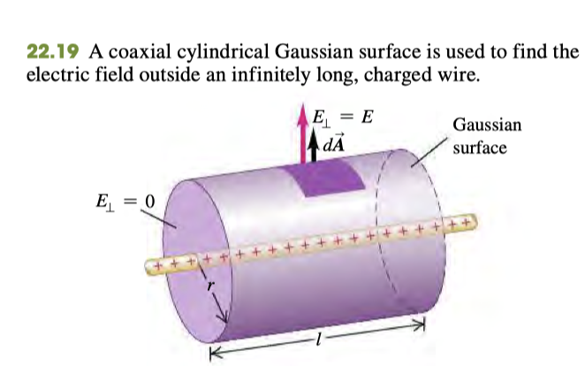
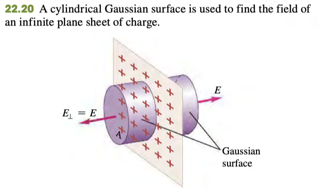

# Chapter 22: Gauss' Law
## Electric Flux of a Uniform Field
$$\Phi_E=EA$$
$$\Phi_E=EA\cos\theta$$
$$\Phi_E=\mathbf{E}\cdot\mathbf{A}$$

## Electric Flux of a Nonuniform Field
$$\Phi_E = \int{\mathbf{E}\cdot d\mathbf{A}}$$

## Total Electric Flux on a Closed Surface (Gauss' Law)
* Only depends on the magnitude of total charge enclosed in the surface
$$\Phi_E=\frac{q}{\epsilon_0}$$
* Total electric field is due to all charges, both inside and outside the surface

## Choosing Gaussian Surface
* Take a part of the surface and enclose it to use gaussian law
* $E$ is $0$ when parallel to surface

### Sphere (when object is circle)
* since spherical symmetric, any point on surface of the sphere has equal Electric Field
* Field lines point radially outward from the center of circle

### Cylinder (when object is infinite line, cylinder)
* For an axially symmetric charge distribution, electric field lines is directed radially outward from center of line from the front
* 
* $E$ on the ends is equal to zero
* 
### Pill box (cylinder with face on plane) (Infinite Plane)
*  
* $E$ on the faces is constant, and 0 everywhere else

## Charges on Conductors
### Special properties of conductors
* Charges can move freely and so
	* Charge is always at the surface
	* Electric Field inside conductor is zero
	* Electric Field is perpendicular to the surface $$E_{\perp}=\frac{\sigma}{\epsilon_0}$$