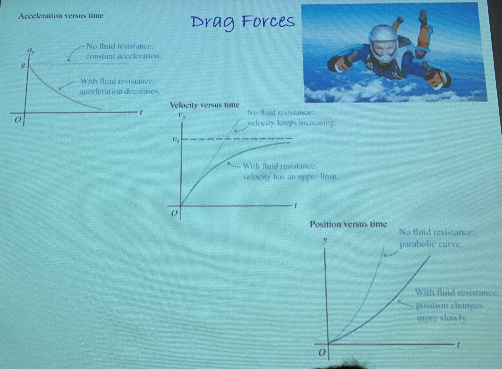

# Chapter 4: Newton's Laws of Motion

---------------------------------

## First Law
An object at rest stays at rest unless acted on by an unbalanced force. 

An object in motion continues to travel with constant velocity unless acted on by an unbalanced force.

## Second Law
Acceleration is parallel to net external force. 

$$\sum\vec{F} = m\vec{a}= \frac{dp}{dt}$$

* **Momentum ($p$)**
	* $p=mv$
* **Impulse ($\Delta p$)**
	* $p=m\Delta v$
*
* Measured in **Newtons ($N$)**
	* $kg\,m\,s^{-2}$

### Equilibrium
$$\sum \vec{F} = 0$$

### Kinds of Forces
#### $F_g$  (Gravitational Force/Weight)
Force due to gravity
$$F_g=mg$$

#### $F_t$  (Tension)
Force along a stretched line (like string or stuff like that)

Net force at any pointing rope is constant

#### $F_f$  (Friction)
Resistive force when an object tries to slide past another object
	$$F_f  = \mu F_n$$
	
μ = coefficient of friction

#### $F_n$  (Normal Force)
Force perpendicular to any surfaces in contact with each other

## Problem Solving in Dynamics
### Free Body Diagrams
* Draw a decent picture
* Select "system" of choice, draw force acting *on* it
* Pick *convenient coordinates* to use Newton's Laws in component form
* Write down Newton's Laws in component form, solve for unknowns
	* Be careful of signs
	* Use magnitude of forces and use signs to indicate directions
	* Check limits

## Third Law
Force of action is equal to force of reaction

$$F_{ab}=F_{ba}$$

Forces always occur in equal and opposite pairs. If object A exerts a force on object B, an equal but opposite force is exerted by object B on object A

### Action/Reaction Pair
Occurs between two objects

# Chapter 5: Newton's Laws Application

---------------------------------

## Friction
### Static Friction ($\mu_s$)
No velocity, changes in magnitude

Equal to whatever is required to keep it static

Two surfaces not moving with respect to each other

$$F_f \leq \mu_s F_n$$

### Kinetic Friction ($\mu_k$)
Friction when object is moving

$$F_f = \mu_k F_n$$
$$\mu_k \leq \mu_s$$

## (Uniform) Circular Motion
### Centripetal Force
uniform when $v$ is constant
$$F_c = \sum F_r = ma_r = \frac{mv^2}{r}$$

### Normal Force
Along vertical circular path, Normal Force approaches zero going from bottom to top 

## Drag Force ($F_D$)
>> 

* Composite of fluid molecules pushing away when falling
	* Probs sum of normal force and friction force from air molecules
* Larger when traveling faster or when surface area is faster

### Terminal Velocity ($v_t$)
$$F_D = F_g$$
$$F_D = bv^n, b\in\text{constant}$$
$$v_t^n = \frac{mg}{b}$$

# Chapter 6: Work and Kinetic Energy

------------------------------

## Work/Energy
$$W=\int_a^b F(x)~dx=\vec{F} \cdot \vec{d}=Fd\cos\theta$$

Equal to sum of forces parallel to direction and the change in position in that direction

Can be positive or negative (if work is being done on object, or work doing object)

Work equal to change of kinetic energy

## Kinetic Energy ($\text{KE}$)
$$E_k = \frac{1}{2}mv^2$$

Measured in Joules ($kg\,m^2\,s^{-2}$)

Scalar Quantity

## Work-Energy Theorem
$$W_{tot} = \Delta\text{KE}$$

## Hooke's Law
$$F = -kx$$
$$W = -\frac{1}{2}kx^2=-\frac{1}{2}k(x_f^2-x_i^2)=\Delta\text{KE}$$

## Power
Rate at which work is done

### Average Power
$$P=\frac{W}{\Delta t}=\frac{\Delta\text{KE}}{\Delta t}$$

### Instantaneous Power
$$P=\frac{dW}{dt}$$

### Power In Terms of Force
$$P = \vec{F}\cdot\vec{v}$$

