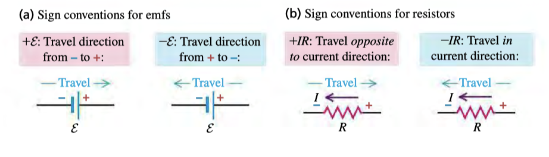

# 26: Direct-Current Circuits

## Resistance in Series
* Constant $I$
* $$R_{eq}=R_1+\cdots+R_n$$

## Resistance in Parallel
* Constant Potential
* $$\frac{1}{R_{eq}}=\frac{1}{R_1}+\cdots+\frac{1}{R_n}$$

## Kirchhoff's Loop Law
$$\sum V_{loop}=0$$

## Kirchhoff's Junction Law
$$\sum I_{junction}=0$$

## Conventions

## Tips
* For multiple loops/junction, there will generally be one fewer independent equation than the number of loops/junction
* Current is always positive, but direction of loop doesn't matter

## R-C Circuits
### Charging and Discharging Capacitors
* If battery is in loop then capacitors charge
* else it will discharge
* The following equations only really apply to capacitors and resistors in series

### Discharge
* $$Q(t)=Q_0e^{-\frac{t}{\tau}}$$
* $$I(t)=\frac{V_0}{R}e^{-\frac{t}{\tau}}$$

### Charge
* $$Q(t)=C\mathcal{E}(1-e^{-\frac{t}{\tau}})$$
* $$I(t)=\frac{\mathcal{E}}{R}e^{-\frac{t}{\tau}}$$

### Time Constant
* $\tau = RC$