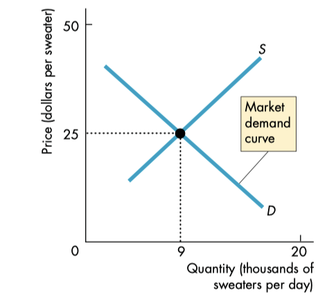
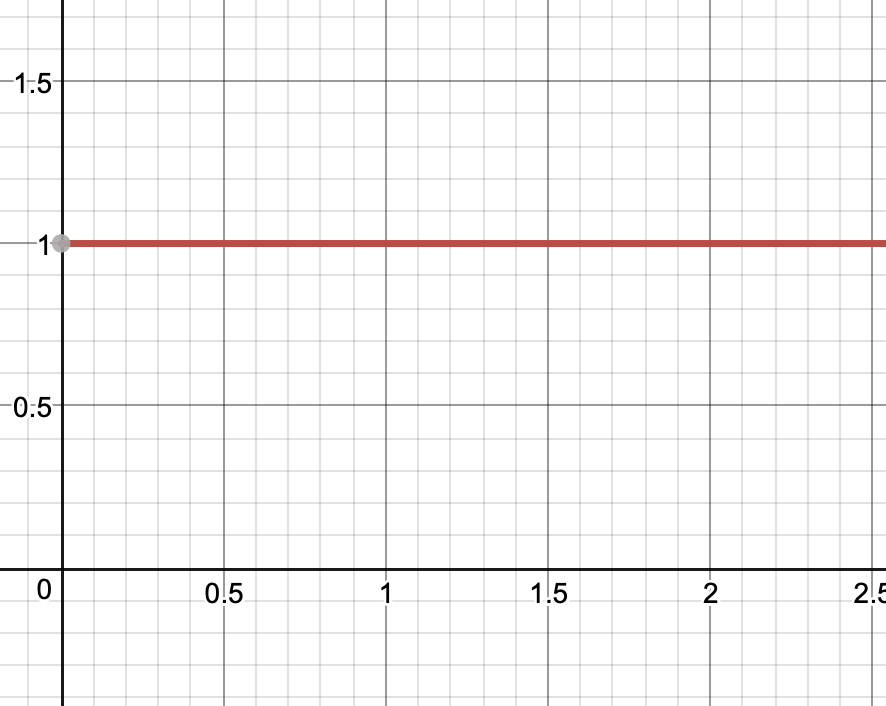
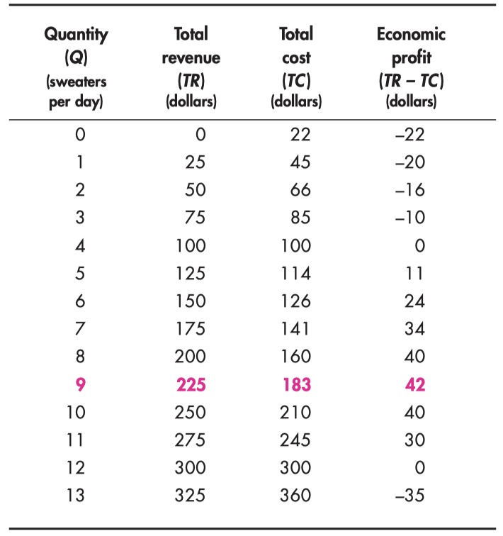
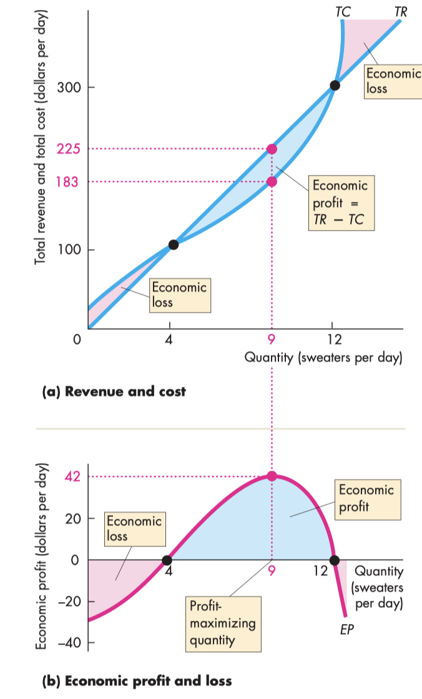
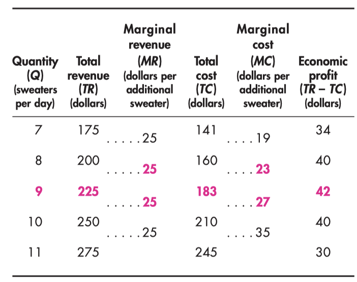
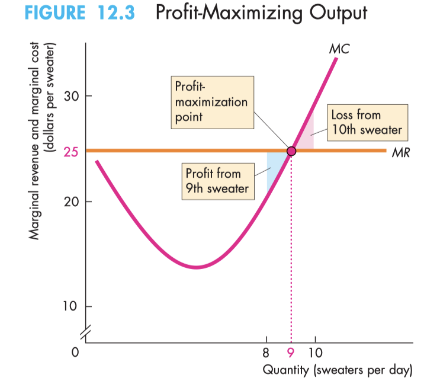

# Market Structure (Chapter 12)
* An environment a firm finds themselves in
* either perfect competition or imperfect competition

# Perfect Competition
## Features
### Many buyers and many sellers
* No control over market due to competitions

### Sellers selling an identical product
* Perfect Substitutes

### No barriers to entry
* Anyone can enter the market

### Established firms have no advantage
* *Clean Air Act (1990)*
	* newer factories can meet regulations better than old ones
		* so clauses were put for old firms, meaning they have more of an advantage than newer firms

### Information symmetry
* Buyers and sellers are well-informed about prices

## Price Takers
* Firms in perfect competition are price takers
* Demand dictates price, not the firms
* Firms have no influence in the market price because their production is an insignificant part of the total market

### Market View in Perfect Competition

### Price Taker View in Perfect Competition

### Short Run Decisions
* **Produce**
	* If $\pi\geq0$ or if losses less than TFC
		* Firms have to pay total fixed costs even without any production, so producing nothing might even be worse
		* $$-\pi<\text{TFC}$$
			* equivalent to $$\text{TR}>\text{TVC}$$
			* Has enough revenue to pay variable costs, and accumulating some revenue to eventually pay  fixed cost
	* 
	* **How Much to Produce**
		* Produce at Quantity that Maximizes Profit
			* $$MR=MC$$
		* **Example**
			* **Table of Quantity and Profit**
				* 
			* **Graph**
				* 
				* **Break Even Points**
					* When $$TR=TC$$
				* **Profit Maximization**
					* Where $TR-TC$ is maximized
			* **Thinking in Margins**
				* **Table with Marginal Stuff**
					* 
				* When firm is price-taker, $MR=P$
				* 
				* **If $MR>MC$** 
					* Producing one more unit increases revenue
					* should produce more units
				* **If $MR=MC$** 
					* Producing one more unit has no effect on profit
					* Since marginal cost is rising, stop here
				* **If $MR < MC$** 
					* Producing one more unit decreases revenue
					* should produce fewer units
					* 
				* **Profit Maximizing Output**
					* 
					* $$\pi = TR-TC = Q(P-ATC)$$
						* Therefore 
							* $P>ATC\implies\pi>0$
								* ATC is below MR curve
							* $P=ATC\implies\pi=0$
								* ATC is at MR
							* $P< ATC\implies\pi< 0$
								* ATC is above MR
				
				
				
* **Shut Down**
	* Though not necessarily exit the market

### Long Run Decisions
* Stay in Industry
	* Decide whether to change fixed inputs
* Exit

## Supply in Short Run
* Firms will always produce at $MR=MC$
* Intersection of AVC and MC is the minimum point
* Look at AVC for shutdown or not and ATC for profit

### Graph of MR and AVC 

* When $P< AVC$
	* $TR< TVC$
	* So not a great quantity to produce, because creates more cost than revenue
	* firms Shut Down
* When $P = AVC$ (at intersection)
	* $TR = TVC$
	* Shutdown point
	* As well off when they produce or not
* When $P > AVC$
	* $TR > TVC$
	* Firm will begin to produce since $MR$ is positive

### Creating a Firm's Supply Curve

* Start at $P=17$ since before that is shut down
* Find $P$ and $Q$ where $MR=MC$ and add as point in graph
* Shows that supply curve in Perfect Competition is equivalent to Marginal Cost curve above $AVC$
	* Slopes up because law of diminishing marginal returns
	* To get market supply, just add $Q_S$ for each price

### Shocks in Market Affecting Supply
* Suppose in industry where $\pi>0$
	* So firms enter market 
	* **In Market Level**
		* market supply increases
	* **in firm level**
		* firm is price taker, and $P=D=MR$ (perfectly elastic)
		* 
		* firm demand decreases

### Profit

#### Change in Demand

* When demand decreases, profit decreases

## Supply in Long Run
### Long Run Equilibrium
#### Assumptions
* All Firms Earn Normal Profit (makes money) but $\pi=0$ (no economic profit)
	* Since if $\pi>0$, market will see entry and demand decreases
* No firms will exit or enter
* No firm has incentive to change its fixed inputs
* Firms produce where $MR=MC$

#### Graph

* Demand intersect with the minimum of LRAC (called minimum efficient scale)
* May not be seen in real life, but shows what firms may gravitate towards
* 
* **Market-Level view**
	* 