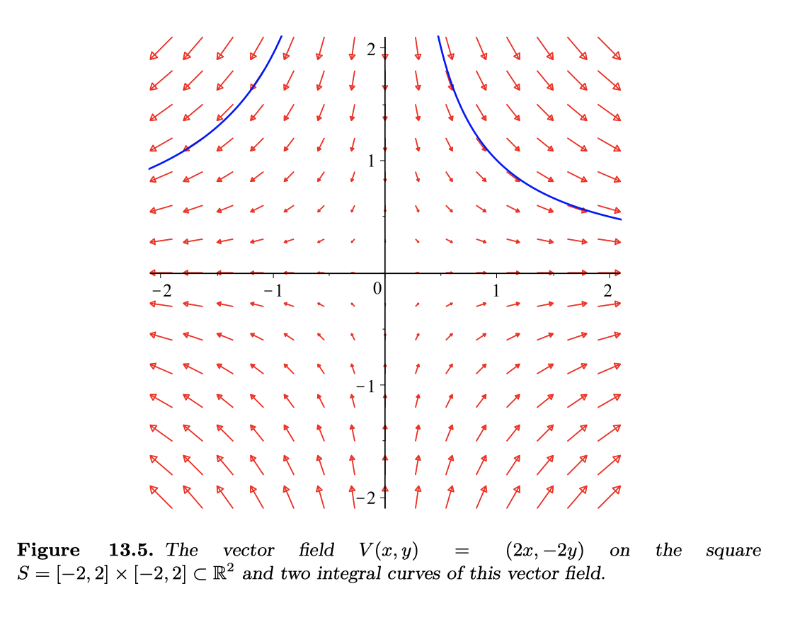

# 13.3 The Chain Rule
## Theorem 13.23 (Chain Rule)
* $\ell,m,n\in\mathbb{N}$
* $U\subset\mathbb{R}^n$, $V\subset\mathbb{R}^m$ both open
* $\mathbf{u}_0\in U$
* $F:U\rightarrow\mathbb{R}^m$
	* $F(U)\subset V$
	* $F$ is differentiable at $\mathbf{u}_0$ 
	* $F(\mathbf{u}_0)=\mathbf{v}_0$
* $G:V\rightarrow\mathbb{R}^\ell$
	* $G$ is differentiable at $\mathbf{v}_0$ 
* Then the composition $G\circ F: U\rightarrow\mathbb{R}^\ell$ is differentiable at $\mathbf{u}_0$ and
	* $$d(G\circ F)(\mathbf{u}_0)=dG(\mathbf{v}_0)\circ dF(\mathbf{u}_0)$$
	* $$\text{Hom}(\mathbb{R}^n,\mathbb{R}^\ell)=\text{Hom}(\mathbb{R}^m,\mathbb{R}^\ell)\text{Hom}(\mathbb{R}^n,\mathbb{R}^m)$$

### Also
* $J_F=[\frac{\partial v^m}{\partial u^n}]$
* $J_G=[\frac{\partial x^\ell}{\partial v^m}]$
* $J_{G\circ F}=[\frac{\partial x^\ell}{\partial u^n}]$
* $$\frac{\partial x^\ell}{\partial u^n}=\sum_{j=1}^m \frac{\partial x^\ell}{\partial v^j}\cdot\frac{\partial v^j}{\partial u^n}$$

## Remark 13.26 (Naturality of the Differential)
* $q= q(x^1,\cdots,x^n)$
* $dq = \frac{\partial q}{\partial x^1} dx^1+\cdots +\frac{\partial q}{\partial x^n} dx^n$
* 
* now suppose $x^n = x^n(u^1,\cdots, u^m)$
* therefore also $q=q(u^1,\dots,u^m)$
* so $dq = \frac{\partial q}{\partial u^1} du^1+\cdots +\frac{\partial q}{\partial u^m} du^m$
* 
* Chain rule shows that the two expressions are equal
	* It's in the notes

## Differentiable Path (Definition 13.27)
* A $C^1$ path in $\mathbb{R}^n$ is a $C^1$ map
* $\gamma:I\rightarrow\mathbb{R}^n$
* $I\subset\mathbb{R}$ is open interval
* $I\ni t \rightarrow \gamma(t)\in\mathbb{R}^n$

### Time Derivative
* $$\dot{\gamma}(t)=\frac{d\gamma}{dt}=\begin{bmatrix} \dot{\gamma}_1(t)\\ \vdots \\ \dot{\gamma}_n(t)\end{bmatrix}$$

## Derivatives along paths (Proposition 13.28)
* $U\subset\mathbb{R}^n$ is open
* $\gamma:(a,b)\rightarrow U$ is a $C^1$ path
* $f:U\rightarrow\mathbb{R}$ is a $C^1$ function
* if $f$ and $\gamma$ are differentiable
* then
	* $$\frac{d}{dt}f(\gamma(t))=\lang\nabla f(\gamma(t)),\dot{\gamma}(t) \rang$$
		* for all $t\in(a,b)$

## Euler's Identity (Example 13.29)
* $f:\mathbb{R}^n\rightarrow\mathbb{R}$ is positively homogenous of degree $k$ if 
	* for any $t>0$ and $\mathbf{x}\in\mathbb{R}^n\setminus\{\mathbf{0}\}$
	* $$f(t\mathbf{x})=t^kf(\mathbf{x})$$
* if $f$ is differentiable on $\mathbb{R}^n\setminus\{\mathbf{0}\}$ then $f$ satisfies Euler's Identity
	* for all $\mathbf{x}\in\mathbb{R}^n\setminus\{\mathbf{0}\}$
	* $$\lang\nabla f(\mathbf{x}),\mathbf{x}\rang = kf(\mathbf{x})$$

## Lagrange Mean Value Theorem (Theorem 13.30)
* $U\subset\mathbb{R}^n$ is open
* $f:U\rightarrow\mathbb{R}$ is $C^1$
* Then for any $\mathbf{x_0,x_1}\in U$ such that $[\mathbf{x_0,x_1}]\subset U$
* then there exists a $\mathbf{p}\in [\mathbf{x_0,x_1}]$ such that $$f(\mathbf{x_1})-f(\mathbf{x_0})=\lang\nabla f(\mathbf{p}),\mathbf{x_1-x_0}\rang$$

## Corollary 13.31 
* $U\subset\mathbb{R}^n$ is open and convex
* $f:U\rightarrow\mathbb{R}$ is $C^1$
* if there exists a $C>0$ such that $\lVert\nabla f(\mathbf{x})\rVert < C$
	* then $f$ is Lipschitz with constant $C$
	* $$|f(\mathbf{x_1})-f(\mathbf{x_2})|< C\lVert\mathbf{x_1}-\mathbf{x_2}\rVert$$

## Corollary 13.32
* $U\subset\mathbb{R}^n$ is open and path connected
* $f:U\rightarrow\mathbb{R}$ is $C^1$ 
* then $\nabla f(\mathbf{x})=0$ for all $\mathbf{x}\in U$
* iff $f$ is constant

## Vector Fields (Definition 13.34i)
* A vector field $V$ on a set $S\subset\Bbb R^n$
* is a map $V:S\rightarrow\Bbb R^n$, $S\ni\mathbf{x}\mapsto V(\mathbf{x})$

## Integral Curve (Definition 13.34ii)
* An integral curve or flow line of a vector field $V$ on a set $S\subset\Bbb R^n$
* is a differential path $\gamma:(a,b)\rightarrow\Bbb R^n$ such that
	* $\gamma(t)\in S$, for all $t\in(a,b)$
	* $\dot{\gamma}(t)=V(\gamma(t))$
		* basically the velocity 

## Vector Field and Integral Curve (Definition 13.34)
* A vector field $V$ is determined by $n$ functions $(V^1,V^2,\cdots,V^n)$
* a path $\gamma$ is determined by $n$ functions $(x^1,x^2,\cdots,x^n)$
* $\gamma$ is a flowline of $V$ if 
	* $$\left\{\begin{matrix}\
		\dot{x}^1(t)=V^1(\gamma(t)) \\
		\dot{x}^2(t)=V^2(\gamma(t)) \\
		\vdots \\
		\dot{x}^n(t)=V^n(\gamma(t))
	\end{matrix}\right.$$
	* $\dot{\gamma}(t)=V(\gamma(t))$

## Example 13.35
* 
	* vector field in red and flowline in blue
* $f:\Bbb R^2\rightarrow\Bbb R$
* $f(x,y)=x^2-y^2$
* $\nabla f(x,y) = [2x,-2y]^T$
* A flow line of $\nabla f$ is given by a pair of functions $x(t),y(t)$ satisfying
	* $\dot{x}(t) = 2x$
	* $\dot{y}(t) = -2y$
* So 
	* $x(t) = x_0e^{2t}$
	* $y(t) = y_0e^{-2t}$

## Example (Hamiltonian)
* $H=H(x,y)$
* $\nabla H = [\frac{\partial H}{x},\frac{\partial H}{y}]^T$
* $V(x,y) = [-\frac{\partial H}{y},\frac{\partial H}{x}]^T$
* $V = \begin{bmatrix}0&-1\\1&0\end{bmatrix}\nabla H$

## Prime Integral/Conservation Law (Definition 13.36)
* $V$ is a vector field on $S\subset\Bbb R^n$
* The prime integral or conservation law for $V$ 
* is a continuous function $f:S\rightarrow\Bbb R$ such that 
	* for any integral curve $\gamma:(a,b)\rightarrow S$ of $V$
	* the quantity $f(\gamma(t))$ is independent of time
		* $$(a,b)\ni t \mapsto f(\gamma(t))\in\Bbb R$$ is constant

## Proposition 13.37
* $U$ is open
* $V:U\rightarrow\Bbb R^n$ is a vector field
* $f\subset C^1(U)$
	* If $$\langle\nabla f(\mathbf{x}), V(\mathbf{x}) \rangle = 0$$
	* for all $\mathbf{x}\in U$
	* then $f$ is a conservation law for $V$

### Example 1 (Hamiltonian)
* $V(x,y) = [-\frac{\partial H}{y},\frac{\partial H}{x}]^T$
* $H$ is a conservation law for $V$
	* since $$\langle\nabla H, V \rangle = -\frac{\partial H}{y}\frac{\partial H}{x}+\frac{\partial H}{y}\frac{\partial H}{x} =0$$

### Example 2 (Force on a Spring)
* $m\ddot{x}=-kx$
* $\ddot{x}=-\frac{k}{m}x$
	* let $\omega^2 =\frac{k}{m}$
* $\ddot{x}=-\omega^2x$
* 
* let $\dot{x}=y$
* $\dot{y}=-\omega^2x$
* 
* Let $E=\frac{1}{2}(\omega^2x^2+y^2)$
	* energy in the system
	* is a conservation law
	