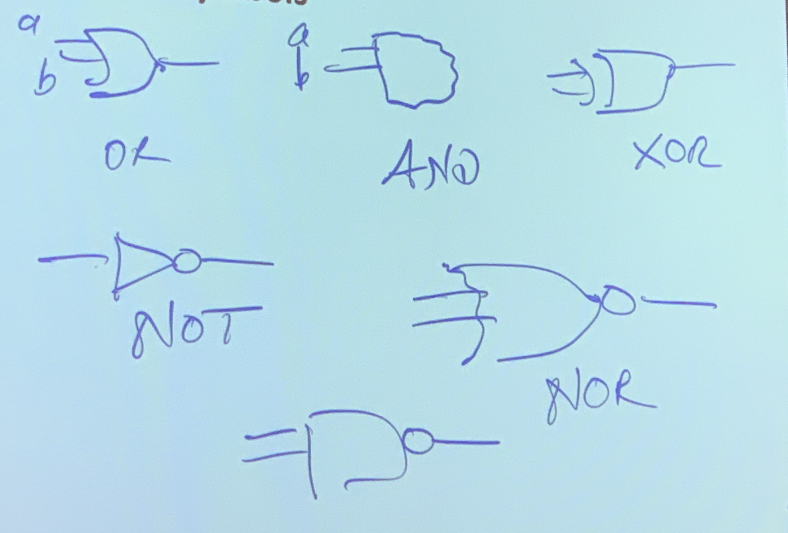

# L03-L04: Digital Logic Gates and Circuits
## Boolean Functions of 2 Variables
### AND
* $ab$
### OR
* $a+b$
### NAND
* $\overline{ab}$
### NOR
* $\overline{a+b}$

## Logic Gate Symbols



## Symbolic Computing Machines
### Logical View
* Symbols
* Rules

### Physical View
* Representing symbols in the physical world
* Mechanical means of implementing rules
	
## CMOS Gates
* Opening and closing switches
* NMOS transistor
	* Initial State is open
	* low voltage opens switch
* PMOS transistor
	* Initial State is closed
	* high voltage opens switch

### Inverter


* Costs 2 transistos

### NAND


* Costs 4 transistors, so AND is 6 transistors
* NAND is series

### NOR

* NOR is parallel

## Verilog
### Ways to Describe Circuit
#### Behavioral
* Data flow
* assign operators

```
moudle voicemail(
	input p,
	input a,
	input c,
	output v
	);
	
	v = c & (~p | p & ~a);

endmodule
```

#### Structural
* A bunch of modules
* instances of modules connected to each other

```
module my_inv(
	input a,
	output y
	);
	
	assign y = ~a;
endmodule

module my_and(
	input a,
	input b,
	output y
	);
	
	assign y = a & b;
endmodule

module my_nand(
	input a,
	input b,
	output y
	);
	
	wire w;
	
	my_and and1(
		.a (a),
		.b (b),
		.y (w)
	);
	
	my_inv not1(
		.a (w)
		.y (y)
	);
endmodule
```