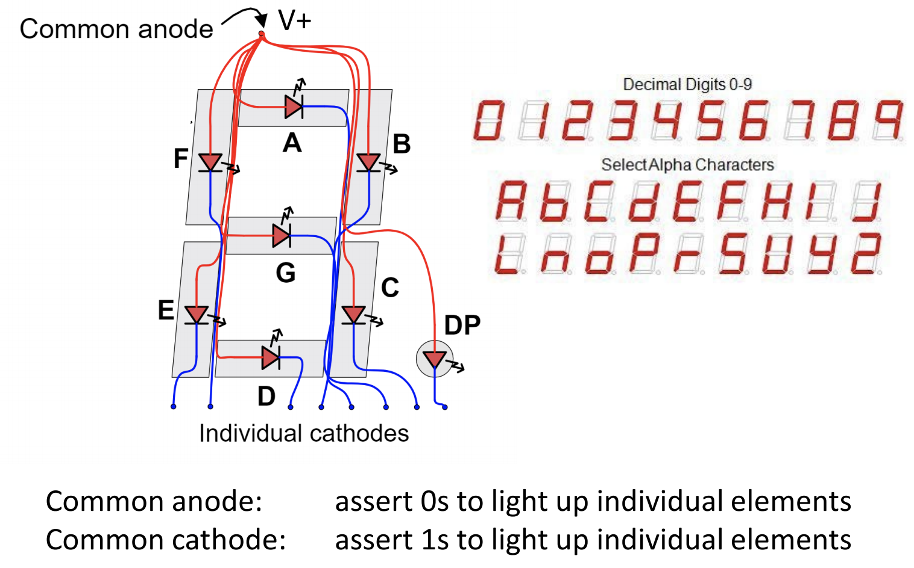

# L07: Combinational Logic Design and Optimization

## Introduction to Timing
### Logical Timing
* No lag between change from high to low

### Physical Timing
* There is a delay from the transition between high and low ($\tau$)

## Karnaugh Map
* Better truth table
* Can only combine powers of two number of cells

## 7 Segment Display
